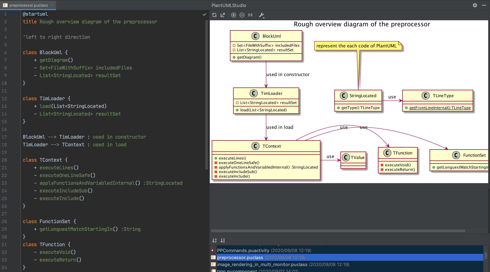
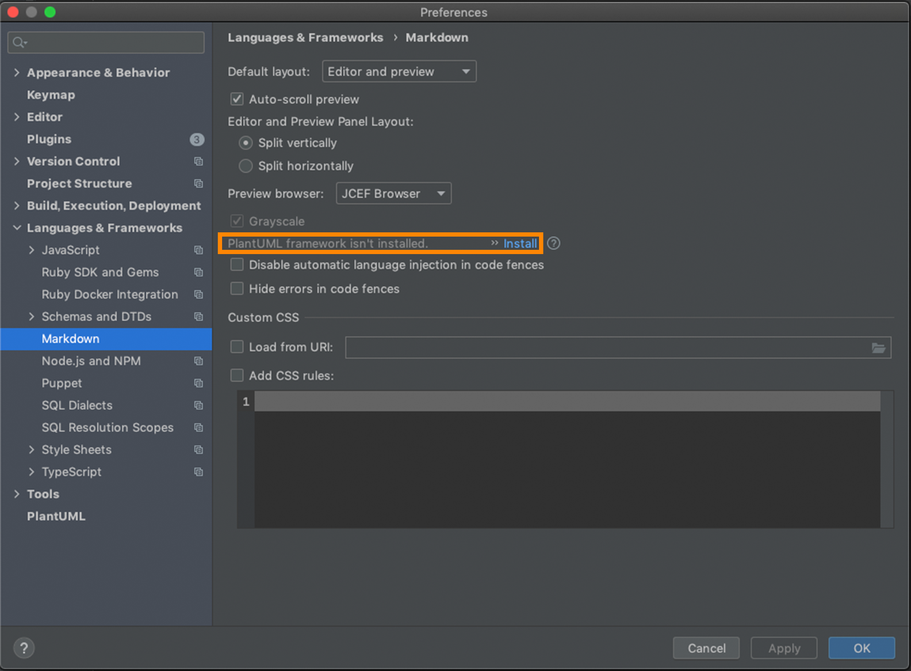

# General Usage

## To recognize existing PlantUML files

Change the extension from the original `puml` or `pu` to the extension of this plugin(correspondence is in the below table).

## Create new file

Select the format of the file you want to create, either the `PlantUML File` with this plugin icon or the one for each diagram(ex: PlantUML Class).

# Support status of PlantUML diagrams

I plan to support all diagrams published in [PlantUML official site](https://plantuml.com/en/).
Most recently, supports of the timing diagram has been released in September 16th, 2020. 

| Diagram type        | Supported | Extension           | Original diagram type |
| ------------- |:-:|:-------------:| :-----:|
| [sequence](https://plantuml.com/en/sequence-diagram)| o | pusequence | - |
| [usecase](https://plantuml.com/en/use-case-diagram)| o | puusecase | - |
| [class](https://plantuml.com/en/class-diagram)| o | puclass | - |
| [activity](https://plantuml.com/en/activity-diagram-beta)| o | puactivity | - |
| [component](https://plantuml.com/en/component-diagram)| o | pucomponent | usecase |
| [state](https://plantuml.com/en/state-diagram)| o | pustate | - |
| [object](https://plantuml.com/en/object-diagram)| o | puobject | class |
| [deployment](https://plantuml.com/en/deployment-diagram)| o | pudeployment | usecase |
| [timing](https://plantuml.com/en/timing-diagram)| o | putiming | - |
| [network](https://plantuml.com/en/nwdiag)| o | punetwork | - |
| [wireframe](https://plantuml.com/en/salt)| not yet | - | - |
| [archmate](https://plantuml.com/en/archimate-diagram)| not yet | - | - |
| [gantt](https://plantuml.com/en/gantt-diagram)| not yet | - | - |
| [mindmap](https://plantuml.com/en/mindmap-diagram)| not yet | - | - |
| [WBS](https://plantuml.com/en/wbs-diagram)| not yet | - | - |

※ The activity diagram supports only [new version](https://plantuml.com/en/activity-diagram-beta).

※ 「What is Original diagram type?」 Some diagrams use the same syntax, regardless of the type of diagram. In that case, the original diagram is represented as the `Original diagram type`.

（For example, the object diagram has the same syntax as the class diagram, so the `Original diagram type` of the object diagram is class.）

# File types and extensions

Although PlantUML can represent all diagrams in the same file format (`puml` or `plantuml`), 
PlantUML Studio treats each diagram as a different file format (different language) to properly support the syntax.

With this method, it may be difficult to maintain consistency with existing operations, or it may be difficult to link with other tools, 
but I think proper syntax support is the value of this plugin. 

---

# Markdown code block support

You can use the editor feature by specifying the format of this plug-in such as `puclass` for the language of the code block.

To preview the diagram, specify `puml` as the language of the code block and
By installing PlantUml from "Languages & Frameworks"> "Markdown"> "Plantuml isn't installed-> install" in Preferences.

---

# File list viewer

The files in the PlantUML Studio format in the project are displayed in a list,
and you can browse the diagram by selecting the file.

## Sort

By default, the file lists are sorted in descending order of updated date,
and you can change the sorting method by pressing the button below.

-  sort by name
-  sort by file type

## Others

You can double-click the file list to open the file.

---

# Settings

Various settings can be made from the button  on the Tool window toolbar.

## Tool Window

### Auto Render Diagram

Whether to update the diagram automatically when the PlantUML code in the editor is changed.

### Auto Show Tool Window

Whether to automatically open the Tool window when opening a PlantUML STUDIO format file.

### Auto Hide Tool Window

Whether to automatically close the Tool window when opening any other file while the PlantUML STUDIO format file is open.

## Tools Panel

### Delay between typing and rendering(ms)

This is the setting of the delay time (milliseconds) from the change of the PlantUML code to the update of the diagram.

### Graphviz dot executable

PlantUML relies on the dot command from [Graphviz](https://graphviz.org/).

By default, the one placed in the place where path passes is used, but if you want to specify anything you can specify it with this setting.

### PlantUML config(equivalent of cmd param '-config config.txt')

You can specify code to be inserted immediately after `@startuml` when drawing the diagram.

For example, you can use it to adjust the style of all diagrams with skinparam.

### Enable the diagram rendering feature in markdown <small>(※ since version 2020.2.3)</small>

Whether to draw a diagram on the preview screen when `puml`, `plantuml`, `puclass format` is specified in the code block in markdown.

